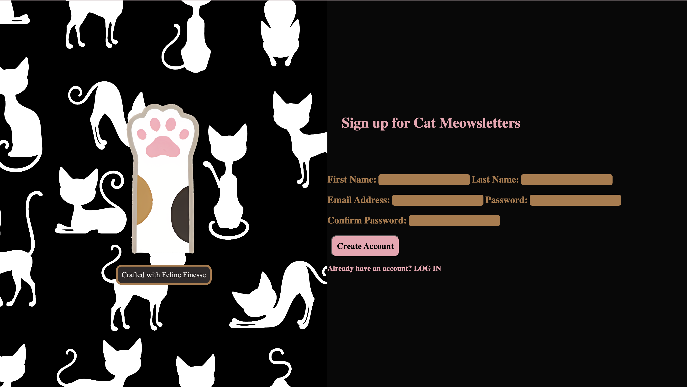

# Sign-up form

I created a sign-up form after learning about forms provided by **The Odin Project**. As a cat lover, I made my form cat-themed.

## Live Demo

[**View the live project here**]( https://aimei60.github.io/sign_up_form/)

## Technologies Used

- HTML5  
- CSS3  
- HTML Forms

## What I Learned

- How to create and style forms using HTML and CSS  
- Gained experience with input types, labels, and validation attributes  
- Learned how to design accessible and user-friendly form layouts

## Preview

Here is a preview of the Sign-up form

## Credits

All images are sourced from https://www.cleanpng.com/ and https://www.freepik.com/
